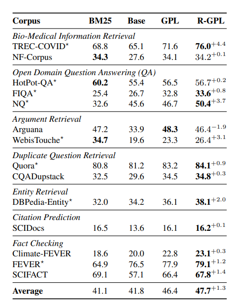
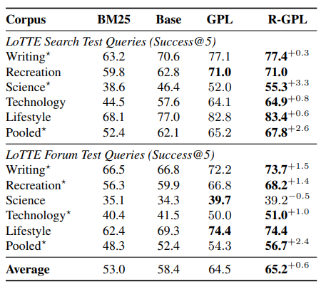

# RGPL
This repository contains the code for paper : [url].

For the pretrained models, you can download them using the huggingface repo. Follow the URL: [URL].

Results for the BEIR and LoTTE sets are below!




 
# Installation 

We provide two ways of installation. You can install the project using poetry, or pip. 

## Installation from source using poetry

1. Clone the repository:

    ```bash
    git clone https://github.com/your-username/DenseIG.git
    ```


2. Install the project using poetry install:

    ```bash
    poetry install
    ```

## Installation from source using pip

1. Clone the repository:

    ```bash
    git clone https://github.com/your-username/DenseIG.git
    ```


2. Install the project using pip install:

    ```bash
    pip install -r requirements.txt
    ```

## Install from pypi 

Additionally, if you want to extend on our code install the source from pypi. 

# Usage


R-GPL works in three stages. First, we generate queries from the source documents. Later, initial hard negatives for these queries are mined using pre-trained dense retriever. Lastly, we use this generated data and distill knowledge from cross-encoder model to the dense retriever model. 

R-GPL remines the hard negatives every k step with the model going under the domain adaptation! You can also specify to distill knowledge from multiple cross-encoder, and play around with the reducer function.


1. Generate Pseudo Queries from the corpus. 

```bash
python3 gpl_query_writer.py data.given_path="PATH_TO_BEIR_DATA" query_writer.batch_size=128
```

To change the config, override these arguments.
```yaml
query_writer:
  queries_per_passage: -1
  batch_size: 8
  augmented: no_aug
  use_train_qrels: False
  top_p: 0.95
  top_k: 25
  max_length: 64
  augment_probability : 1.0
  forward_model_path: Helsinki-NLP/opus-mt-en-fr
  back_model_path: Helsinki-NLP/opus-mt-fr-en
  augment_per_query : 2
  augment_temperature : 2.0
```

When queries per passage is -1, we use the predetermined query amount. Augmentation is not used in our paper, however you are free to experiment with it. This augmentation first tranlates the generated query to french, and then back translates into english.


2. Mine the initial hard negatives
```bash
python3 gpl_hard_negative_miner.py data.given_path="PATH_TO_BEIR_DATA"

```
To change the config, override these arguments. 
```yaml
hard_negative_miner:
  negatives_per_query: 50
  query_augment_mod: ${query_writer.augmented}
  models: ["msmarco-distilbert-base-v3", "msmarco-MiniLM-L-6-v3"]
  score: [cos_sim, cos_sim]
  use_train_qrels: False
```
3. Start the training procedure

```bash
python3 gpl_trainer.py data.given_path=data.given_path="PATH_TO_BEIR_DATA"
```

To change the config, override these arguments. 
```yaml 
trainer:
  cross_encoders : ["cross-encoder/ms-marco-MiniLM-L-6-v2"]
  bi_retriver : GPL/msmarco-distilbert-margin-mse
  bi_retriver_name: gpl
  reducer : average
  t_total: 140000
  eval_every: 25000
  remine_hard_negatives_every: 25000
  batch_size: 32
  warmup_steps: 1000
  amp_training: True
  evaluate_baseline: False
  load_test : True
  max_seq_length: 350
  seed: 1
  name: ${trainer.remine_hard_negatives_every}_${trainer.bi_retriver_name}_${trainer.reducer}
```

We extend the GPL Training pipeline, and now we can also use multiple cross encoders as teachers. This feature was not included in our paper, however you are free to experiment with it! 

To have the same setup as GPL paper, bump remine_hard_negatives_every to a number > 140000.

Trainer saves the models, and logs in the directory that the model was called from. Moreover, hard negatives each refresh, generated queries, and generated qrels are saved in the PATH_TO_BEIR_DATA.

# Expected Results

Running the repo following the comments below with the provided test data should result in 

```bash
python3 gpl_query_writer.py data.given_path=test_data/arguana query_writer.queries_per_passage=1
```

```bash
python3 gpl_hard_negative_miner.py data.given_path=test_data/arguana```
```

```bash
python3 gpl_trainer.py data.given_path=test_data/arguana trainer.t_total=2000 trainer.remine_hard_negatives_every=1000 trainer.batch_size=8
```

Before:
NDCG@10: 0.3388
After:
NDCG@10: 0.3853


